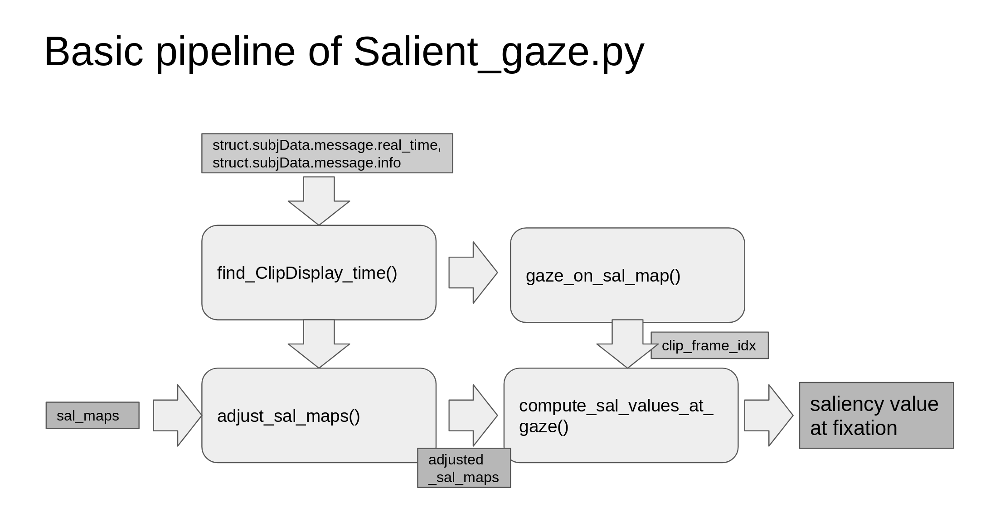
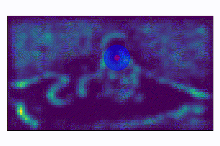

## SaliencyFeatures

#### Generate saliency values at fixation points for each trials.
#### two pickle files are generated, one for normal saliency map, the other for convolved saliency map.
#### a data structure of size 1 x clip_num x channel_num will be created for each repective *Clip.mat eyetracking file in separate folders.
#### You can choose not to plot the figures by deactivating savefig function in salient_gaze.py, which will fascilitate the process.

Run multiprocess.py to generate saliency values or saliency maps.

gaze_saliency.py supports generate n_th saliency maps after clippet transition.
 
The resulting 

